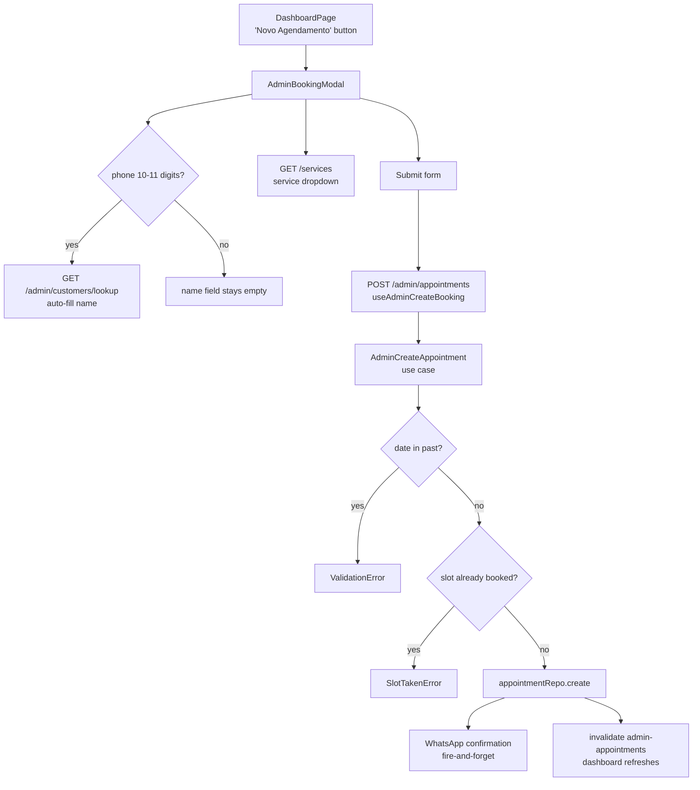

# Admin Manual Booking — Design

**Spec**: `.specs/features/admin-manual-booking/spec.md`
**Status**: Draft

---

## Architecture Overview

The feature adds a thin layer on top of the existing booking infrastructure. The key insight: `CreateAppointment` already does everything we need except it validates shift coverage. We create a new `AdminCreateAppointment` use case that is identical but skips that one check. No schema changes needed.



---

## Code Reuse Analysis

### Existing Components to Leverage

| Component | Location | How to Use |
|---|---|---|
| `Button` | `packages/web/src/components/ui/Button.tsx` | Primary submit + secondary cancel in modal |
| `Input` | `packages/web/src/components/ui/Input.tsx` | All form fields (name, phone, date, time) |
| `Spinner` | `packages/web/src/components/ui/Spinner.tsx` | Loading state inside Button (already handled by Button's `loading` prop) |
| `CancelModal` pattern | `DashboardPage.tsx:201` | Same fixed overlay + centered card pattern for AdminBookingModal |
| `authRequest` | `packages/web/src/api/auth-request.ts` | Authenticated fetch wrapper for new hooks |
| `formatPhone` / `stripPhone` | `packages/web/src/lib/format.ts` | Phone formatting in the form |
| `CreateAppointment` | `packages/api/src/application/use-cases/booking/create-appointment.ts` | Copy and strip shift validation |
| `WhatsAppNotificationService` | `packages/api/src/infrastructure/notifications/whatsapp-notification.service.ts` | Call `sendBookingConfirmation` — identical to customer flow |
| `bookingSchema` (timeRegex, dateRegex) | `packages/shared/src/validation.ts` | Reuse regex patterns for inline validation |

### Integration Points

| System | Integration Method |
|---|---|
| `/services` (public endpoint) | Frontend fetches services for dropdown — no auth needed, reuses existing route |
| `appointmentRepo.create` | `AdminCreateAppointment` calls same repo method — double-booking caught by DB unique constraint (P2002) |
| `customerRepo.upsertByPhone` | Same upsert as customer-facing flow — no changes needed |
| `['admin-appointments']` query key | Invalidated on success — dashboard list refreshes automatically |

---

## Components

### `AdminCreateAppointment` (API use case)

- **Purpose**: Creates an appointment on behalf of a barber, bypassing shift validation but enforcing all other rules
- **Location**: `packages/api/src/application/use-cases/booking/admin-create-appointment.ts`
- **Interfaces**:
  - `execute(input: AdminCreateAppointmentInput): Promise<{ appointment: AppointmentWithDetails; cancelUrl: string }>`
- **Dependencies**: Same repos as `CreateAppointment` — `appointmentRepo`, `serviceRepo`, `barberRepo`, `customerRepo`, `notificationService`
- **Reuses**: Identical to `CreateAppointment` with one change — remove the shift coverage block (lines 54–63 in create-appointment.ts). Keep: past-date check, double-booking check, customer upsert, WhatsApp notification.

```typescript
interface AdminCreateAppointmentInput {
  serviceId: string;
  barberId: string;   // injected from JWT in the route, not from request body
  date: string;
  startTime: string;
  customerName: string;
  customerPhone: string;
}
```

---

### `POST /admin/appointments` (API route)

- **Purpose**: Admin-authenticated endpoint that calls `AdminCreateAppointment`
- **Location**: `packages/api/src/http/routes/admin.routes.ts` (add to existing file)
- **Interfaces**: `POST /admin/appointments` — body matches `AdminCreateAppointmentInput` minus `barberId` (injected from JWT)
- **Validation**: Reuse `bookingSchema` from `@soberano/shared` but omit `barberId` from the body (barber is the authenticated user)
- **Dependencies**: `authGuard` already applied to all `/admin/*` routes
- **Reuses**: Same repo instances already instantiated at top of `admin.routes.ts`

```typescript
// Request body (barberId comes from request.barberId via JWT)
{
  serviceId: string;   // UUID
  date: string;        // YYYY-MM-DD
  startTime: string;   // HH:mm
  customerName: string;
  customerPhone: string;
}
```

---

### `GET /admin/customers/lookup` (API route)

- **Purpose**: Returns customer name for a given phone number, enabling auto-fill in the modal
- **Location**: `packages/api/src/http/routes/admin.routes.ts` (add to existing file)
- **Interfaces**: `GET /admin/customers/lookup?phone=:phone` → `{ name: string } | { name: null }`
- **Dependencies**: `customerRepo` — add `findByPhone(phone: string)` method to the repository
- **Reuses**: `authGuard` already covers it

---

### `findByPhone` (repository method)

- **Purpose**: Lookup a customer by exact phone for the admin auto-fill
- **Location**: `packages/api/src/domain/repositories/customer.repository.ts` (add to interface) + `packages/api/src/infrastructure/database/repositories/prisma-customer.repository.ts` (implement)
- **Interfaces**: `findByPhone(phone: string): Promise<Customer | null>`
- **Dependencies**: Prisma `customer` model — simple `findUnique` by phone

---

### `useAdminCreateBooking` (frontend hook)

- **Purpose**: Mutation hook that calls `POST /admin/appointments`
- **Location**: `packages/web/src/api/use-admin.ts` (add to existing file)
- **Interfaces**:
  ```typescript
  function useAdminCreateBooking(): UseMutationResult<AdminAppointment, Error, AdminBookingInput>
  
  interface AdminBookingInput {
    serviceId: string;
    date: string;       // YYYY-MM-DD
    startTime: string;  // HH:mm
    customerName: string;
    customerPhone: string;
  }
  ```
- **Dependencies**: `authRequest`, `queryClient`
- **Reuses**: Same `authRequest` pattern as `useAdminCancelAppointment`; invalidates `['admin-appointments']` on success

---

### `useAdminCustomerLookup` (frontend hook)

- **Purpose**: Query that fetches an existing customer's name by phone for auto-fill
- **Location**: `packages/web/src/api/use-admin.ts` (add to existing file)
- **Interfaces**:
  ```typescript
  function useAdminCustomerLookup(phone: string): UseQueryResult<{ name: string | null }>
  ```
- **Behavior**: `enabled` only when `phone.length >= 10`. Debounce input 400ms before triggering (use a local `debouncedPhone` state in the modal component).
- **Reuses**: `authRequest` pattern

---

### `AdminBookingModal` (frontend component)

- **Purpose**: Modal form that lets a barber create a manual booking for a customer
- **Location**: `packages/web/src/components/admin/AdminBookingModal.tsx`
- **Interfaces**:
  ```typescript
  interface AdminBookingModalProps {
    onClose: () => void;
  }
  ```
- **Form fields** (in order):
  1. Phone (`Input`, `inputMode="tel"`, masked with `formatPhone`) — triggers customer lookup
  2. Name (`Input`, auto-filled from lookup, editable)
  3. Service (`<select>`, styled to match existing dark theme, populated from `GET /services`)
  4. Date (`Input type="date"`, min = today)
  5. Time (`Input`, placeholder "09:00", validated against `HH:mm` regex on blur)
- **Submit validation** (client-side, before sending):
  - Phone: 10–11 digits
  - Name: ≥ 2 chars
  - Service: non-empty selection
  - Date: not in past
  - Time: matches `/^([01]\d|2[0-3]):[0-5]\d$/`
- **Error display**: Inline below the submit button, same style as other forms in the codebase
- **Dependencies**: `useAdminCreateBooking`, `useAdminCustomerLookup`, `Input`, `Button`, `Spinner`, `formatPhone`, `stripPhone`
- **Reuses**: Exact same modal shell (overlay + card) as `CancelModal` in DashboardPage

---

### `DashboardPage` changes

- **Location**: `packages/web/src/pages/admin/DashboardPage.tsx`
- **Changes**:
  1. Add `const [showBookingModal, setShowBookingModal] = useState(false)` state
  2. Add "Novo Agendamento" button in the header row (next to the date label)
  3. Render `<AdminBookingModal onClose={() => setShowBookingModal(false)} />` when `showBookingModal === true`
- **Button style**: Small, gold, consistent with the dashboard's existing action buttons

---

## Data Models

No new database tables or schema migrations needed. All data maps to existing `appointments`, `customers`, and `services` tables.

---

## Error Handling Strategy

| Error Scenario | Handling | User Impact |
|---|---|---|
| Slot already taken (P2002 / SlotTakenError) | API returns 409, hook surfaces error | Modal shows "Horário já ocupado" inline |
| Past date submitted | `AdminCreateAppointment` throws `ValidationError` | Modal shows "Não é possível agendar em uma data passada" |
| Invalid time format | Client-side regex on blur | Field shows error before submission |
| Service not found | API returns 404 | Modal shows generic "Serviço não encontrado" |
| WhatsApp failure | Fire-and-forget — logged, not surfaced | Booking still created; no user-visible error |
| Customer lookup fails | Query error silently ignored | Name field stays empty, barber types manually |

---

## Tech Decisions

| Decision | Choice | Rationale |
|---|---|---|
| New use case vs. flag on existing | New `AdminCreateAppointment` class | Avoids polluting `CreateAppointment` with `isAdmin` branching; clean separation of concerns |
| `barberId` source in admin booking | Injected from JWT (`request.barberId`) | Barber can only book for themselves; prevents spoofing |
| Services list source | Existing public `GET /services` endpoint | Already returns all active services with id/name/icon/price; no duplication needed |
| Customer lookup timing | Debounced query at 10-digit threshold | Avoids hammering the API on every keystroke; phone is complete enough at 10 digits |
| No priceCents override for admin | Price comes from service catalog | Consistent pricing; custom pricing deferred to monthly plan feature |
