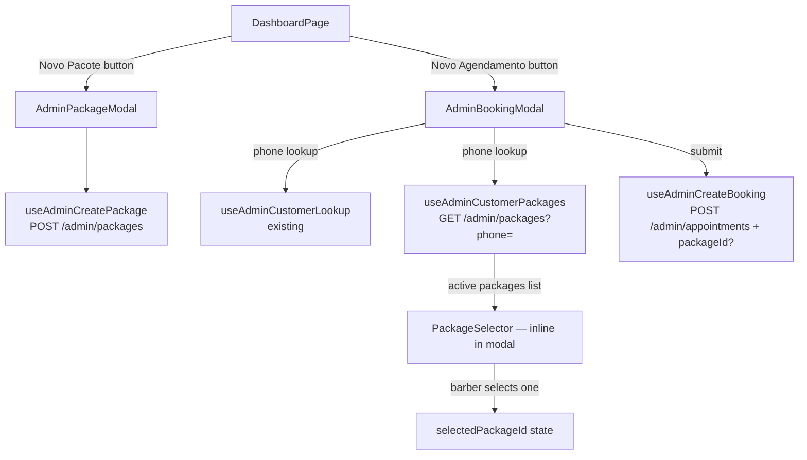

# Customer Packages Design

**Spec**: `.specs/features/customer-packages/spec.md`
**Status**: Draft

---

## Rescope Update — Provider-Owned Management Expansion

This design originally covered the first package MVP: create a package, select it during manual booking, and list packages in a basic management page. The current request expands that scope and changes two important assumptions:

1. Packages are no longer tenant-wide management records; they are provider-owned commercial agreements.
2. Package status can no longer be derived from `usedCount >= totalUses` alone.

### Recommended UX Direction

Use one shared **package workspace modal** instead of inventing separate booking flows for each entry point:

- `AdminPackageModal` remains the lightweight creation step
- after successful creation, it hands the created package into the shared package workspace instead of simply closing
- `PackagesPage` opens the same workspace from each package card for details and additional scheduling
- `AdminBookingModal` keeps the inline package selector for the general booking flow

This avoids duplicating scheduling logic in two places and gives the provider one consistent package-first management surface.

### Recommended Shared Workspace Shape

The existing `BookFromPackageModal.tsx` is the best starting point for refactoring into that shared workspace.

The evolved modal should support two package-context modes:

1. **Schedule mode**
   - used immediately after package creation
   - used from the Packages page when a package still has remaining usages
   - allows sequential booking of one or more usages without leaving the package context
2. **Details mode**
   - shows package summary, remaining uses, and linked bookings
   - exposes package-linked booking management actions from the same context
   - can transition into schedule mode when the package still has remaining usages

### Key Contract Gaps Confirmed During Recon

The current codebase does not support the full request as a web-only change:

- `CustomerPackage` has no `providerId`, so ownership cannot be enforced from the frontend alone
- `GET /admin/packages` is tenant-scoped, not provider-scoped
- package status is currently flipped to `completed` inside `incrementUsedCount()` as soon as all credits are allocated
- the web layer does not have a package-specific booking details contract yet; existing appointment range data is provider-scoped, but not package-focused

That means the UI can be redesigned now, but correct provider isolation and lifecycle behavior require API and schema updates.

There is also no package-specific provider payment reminder today. Existing barber notifications cover only new bookings, customer-driven changes/cancellations, and the generic upcoming appointment reminder.

---

## Architecture Overview

Two independent entry points converge on the same backend resource (`/admin/packages`):

1. **Create path** — barber opens `AdminPackageModal` from `DashboardPage`, creates a package
2. **Select & consume path** — barber opens `AdminBookingModal`, looks up a customer; if they have active packages a selector appears and the chosen `packageId` is injected into the booking payload



No new pages, no routing changes. Both flows are modal-based.

---

## Code Reuse Analysis

### Existing Components to Leverage

| Component | Location | How to Use |
|---|---|---|
| `Input` | `components/ui/Input.tsx` | Reuse for phone, name, price, uses fields |
| `Button` | `components/ui/Button.tsx` | Reuse for submit with `loading` prop |
| `useAdminCustomerLookup` | `api/use-admin.ts` | Exact same debounce+autofill pattern for name in `AdminPackageModal` |
| `formatPhone` / `stripPhone` | `lib/format.ts` | Same phone formatting as `AdminBookingModal` |
| `AdminBookingModal` | `components/admin/AdminBookingModal.tsx` | Model for new modal structure; copy debounce pattern |

### Integration Points

| System | Integration Method |
|---|---|
| `POST /admin/appointments` | Add optional `packageId` field to existing `AdminBookingInput` type |
| `POST /admin/packages` | New mutation; returns `CustomerPackage` |
| `GET /admin/packages?phone=` | New query; returns `CustomerPackage[]` (active packages only) |
| `GET /admin/packages` | Must become provider-scoped and support the Packages page default active-first view |
| Package details contract | New or extended admin package endpoint needed for linked booking details |
| `WhatsAppNotificationService.sendBookingConfirmation` | Package-linked admin bookings omit the self-service cancel/change link; non-package admin bookings keep the existing template |

---

## Data Models

### CustomerPackage

```typescript
export interface CustomerPackage {
  id: string
  providerId: string
  customerName: string
  customerPhone: string | null
  totalUses: number
  usedCount: number
  totalPriceCents: number
  status: 'active' | 'completed' | 'cancelled'
  createdAt: string
}
```

### AdminCreatePackageInput

```typescript
export interface AdminCreatePackageInput {
  customerName: string
  customerPhone?: string   // optional — barber may not have it
  totalUses: number
  totalPriceCents: number
}
```

### AdminBookingInput (modified)

```typescript
export interface AdminBookingInput {
  serviceId: string
  date: string
  startTime: string
  customerName: string
  customerPhone?: string
  priceCents?: number
  packageId?: string        // NEW — present only when barber selects a package
}
```

---

## Components

### `useAdminCreatePackage` (new hook)

- **Purpose**: Mutation to create a customer package via `POST /admin/packages`
- **Location**: `packages/web/src/api/use-admin.ts` (append)
- **Interfaces**:
  - `mutate(input: AdminCreatePackageInput): void`
  - Returns TanStack `UseMutationResult`
- **Dependencies**: `authRequest`, `useQueryClient`
- **Reuses**: Same pattern as `useAdminCreateBooking` — invalidates `['admin-packages']` on success

### `useAdminCustomerPackages` (new hook)

- **Purpose**: Query to fetch all active packages for a customer by phone
- **Location**: `packages/web/src/api/use-admin.ts` (append)
- **Interfaces**:
  - `useAdminCustomerPackages(phone: string): UseQueryResult<CustomerPackage[]>`
- **Dependencies**: `authRequest`
- **Reuses**: Same `enabled: phone.length >= 10` guard as `useAdminCustomerLookup`; `staleTime: 30_000`
- **Note**: Returns only `status === 'active'` packages (backend filters, or frontend can filter client-side if backend returns all)

### `AdminPackageModal` (new component)

- **Purpose**: Modal form to create a customer package
- **Location**: `packages/web/src/components/admin/AdminPackageModal.tsx`
- **Props**: `{ onClose: () => void }`
- **Internal state**: `phone`, `name`, `usesDisplay`, `priceDisplay`, `lookupPhone`
- **Behavior**:
  - Phone → debounced name autofill (same 400ms pattern as `AdminBookingModal`)
  - `usesDisplay` — integer input, minimum 1
  - `priceDisplay` — decimal input with comma→dot normalization (same as existing price field)
  - Submit disabled until: `name.trim().length >= 2 && uses >= 1 && price > 0`
  - On success: hands the created package into the shared package workspace instead of dropping the provider back on the dashboard
  - On error: shows server error message inline below button
- **Dependencies**: `useAdminCreatePackage`, `useAdminCustomerLookup`, `Input`, `Button`, `formatPhone`, `stripPhone`
- **Reuses**: `AdminBookingModal` as structural reference

### `PackageWorkspaceModal` (refactor from `BookFromPackageModal`)

- **Purpose**: Shared package-context modal used both after package creation and from the Packages page
- **Starting point**: `packages/web/src/components/admin/BookFromPackageModal.tsx`
- **Responsibilities**:
  - show package summary and remaining usage information
  - schedule one or more usages in sequence
  - list already linked package bookings
  - expose package-linked booking management actions from the package context
- **Why reuse this file**: it already owns the package-scoped scheduling payload (`packageId`) and sequential booking behavior, so it is the right foundation instead of creating a second custom scheduler from scratch

### `AdminBookingModal` (modified)

- **Purpose**: Existing modal — add package selector
- **Location**: `packages/web/src/components/admin/AdminBookingModal.tsx`
- **New state**: `selectedPackageId: string | null` (null = no package linked)
- **Changes**:
  1. Call `useAdminCustomerPackages(lookupPhone)` — same `lookupPhone` state already present
  2. Reset `selectedPackageId` to `null` when `lookupPhone` changes (customer changed)
  3. When `packages` array loads with results, auto-select if exactly one package; leave null if multiple
  4. Render **PackageSelector** between name field and service selector:
     - If 0 packages: render nothing
     - If 1 package: render a single selectable pill (pre-selected, can be deselected)
     - If 2+ packages: render a list of selectable pills (none pre-selected)
     - Each pill shows: `"{N}/{M} usos"` — selected pill uses gold border, unselected uses muted border
     - Clicking a selected pill deselects it (sets `selectedPackageId` to `null`)
  5. In `handleSubmit`, spread `packageId` only when `selectedPackageId` is set
- **Zero behavior change** when customer has no packages

### Package-linked booking confirmation rule

- **Purpose**: Keep package-linked admin bookings provider-managed by omitting self-service cancel/change links from the customer WhatsApp confirmation
- **Scope**:
  - Applies when `POST /admin/appointments` is called with `packageId`
  - Applies to both `AdminBookingModal` and `BookFromPackageModal`, because both submit the same route with `packageId`
  - Does **not** apply when `packageId` is absent
- **Implementation direction**:
  - `AdminCreateAppointment` uses the presence of `packageId` to choose the notification variant
  - `WhatsAppNotificationService.sendBookingConfirmation` accepts an option or variant to omit the final "Para cancelar ou alterar" block when the booking is package-linked

### Package completion payment reminder rule

- **Purpose**: Remind the provider to collect the package payment when the final package appointment is actually completed
- **Trigger for this scope**:
  - an admin package-linked appointment is marked `completed`
  - package lifecycle reevaluation changes the package from `active` to `completed`
- **Non-triggers**:
  - package reaches `completed` after `no_show`
  - package reaches `completed` after cancellation, deletion, or manual package deactivation
  - the last appointment is only in the past but has not been explicitly marked `completed`
- **Implementation direction**:
  - keep the trigger inside the same package-aware lifecycle service/use case that already reevaluates package status after appointment mutations
  - compare the package state before and after reevaluation so the reminder is sent only on the `active` → `completed` transition
  - add a dedicated `WhatsAppNotificationService` method for this barber-facing reminder instead of overloading `notifyBarber()`
  - include at least `customerName` and `totalPriceCents` in the message body

### `DashboardPage` (modified)

- **Purpose**: Add "Novo Pacote" button and wire `AdminPackageModal`
- **Location**: `packages/web/src/pages/admin/DashboardPage.tsx`
- **Changes**:
  1. Add `packageModalOpen` state (boolean)
  2. Add "Novo Pacote" button — secondary style (gold border, transparent bg) — placed adjacent to the existing "Novo Agendamento" button
  3. Conditionally render `<AdminPackageModal onClose={() => setPackageModalOpen(false)} />`

---

## Error Handling Strategy

| Error Scenario | Handling | User Impact |
|---|---|---|
| Network error on package creation | Show server `message` inline below submit button | Red text, same pattern as `AdminBookingModal` |
| Package lookup fails | Silent — treat as empty list | No selector shown; booking proceeds as normal |
| Booking submit with stale/invalid packageId | Server returns error | Error shown in existing booking error area |
| Package details unavailable for current provider | Show package error state inside workspace | Provider does not see another provider's data |

---

## Tech Decisions

| Decision | Choice | Rationale |
|---|---|---|
| Package selector UI | Selectable pills (not a `<select>`) | Consistent with existing time-slot pill pattern in `AdminBookingModal`; scannable at a glance |
| Single-package auto-select | Yes — auto-select when exactly one active package | Saves a tap for the common case; can be deselected if barber doesn't want to link |
| Multi-package behavior | None pre-selected | When there are 2+, the barber must choose explicitly — prevents silently consuming the wrong package |
| `packageId` injection | Only when `selectedPackageId !== null` | Barber retains full control; no implicit side-effects |
| New modal vs extending `AdminBookingModal` | New `AdminPackageModal` — separate concern | Package creation is not a booking; mixing would bloat the existing modal |
| Package page booking UX | Reuse one shared package workspace modal | Keeps scheduling and details logic in one place across post-create and Packages page entry points |
| Initial Packages page filter | `active` by default | Matches provider mental model and reduces information overload |
| Package lifecycle label | Stay `active` while future linked bookings exist | Prevents premature completion state when all uses are merely allocated |
| Provider payment reminder trigger | Only on package `active` → `completed` caused by a `completed` appointment | Avoids asking the barber to charge on `no_show`, cancellation, or manual deactivation |

---

## Backend Design

### DB Schema

Two changes to `schema.prisma`:

**New model `CustomerPackage`:**

```prisma
model CustomerPackage {
  id              String   @id @default(uuid()) @db.Uuid
  tenantId        String   @map("tenant_id") @db.Uuid
  providerId      String   @map("provider_id") @db.Uuid
  customerName    String   @map("customer_name") @db.VarChar(200)
  customerPhone   String?  @map("customer_phone") @db.VarChar(20)
  totalUses       Int      @map("total_uses")
  usedCount       Int      @default(0) @map("used_count")
  totalPriceCents Int      @map("total_price_cents")
  status          String   @default("active") @db.VarChar(20)
  createdAt       DateTime @default(now()) @map("created_at") @db.Timestamptz
  updatedAt       DateTime @default(now()) @updatedAt @map("updated_at") @db.Timestamptz

  tenant       Tenant        @relation(fields: [tenantId], references: [id])
  provider     Provider      @relation(fields: [providerId], references: [id])
  appointments Appointment[]

  @@index([tenantId, providerId, customerPhone, status])
  @@map("customer_packages")
}
```

**Modified `Appointment` model** — add optional FK:

```prisma
packageId  String?          @map("package_id") @db.Uuid
package    CustomerPackage? @relation(fields: [packageId], references: [id])
```

**Modified `Tenant` model** — add relation:

```prisma
customerPackages CustomerPackage[]
```

---

### Domain Entity

**File**: `packages/api/src/domain/entities/customer-package.ts`

```typescript
export interface CustomerPackageEntity {
  id: string
  tenantId: string
  customerName: string
  customerPhone: string | null
  totalUses: number
  usedCount: number
  totalPriceCents: number
  status: 'active' | 'completed'
  createdAt: Date
  updatedAt: Date
}
```

---

### Repository Interface

**File**: `packages/api/src/domain/repositories/customer-package.repository.ts`

```typescript
export interface CustomerPackageRepository {
  create(data: {
    tenantId: string
    customerName: string
    customerPhone?: string
    totalUses: number
    totalPriceCents: number
  }): Promise<CustomerPackageEntity>

  findActiveByPhone(tenantId: string, phone: string): Promise<CustomerPackageEntity[]>

  findByIdAndTenant(id: string, tenantId: string): Promise<CustomerPackageEntity | null>

  incrementUsedCount(id: string): Promise<CustomerPackageEntity>
}
```

**Implementation notes for `incrementUsedCount`**:
- Increment `usedCount` by 1 with `{ increment: 1 }`
- In the same Prisma call, read the updated record
- If `result.usedCount >= result.totalUses`, issue a second update setting `status = 'completed'`
- This is two sequential operations, not a true transaction — acceptable at this scale (single-tenant barbershop, low concurrency). Note this trade-off explicitly.

---

### Endpoint Contracts

#### `POST /admin/packages`

**Request body** (Zod-validated via `createPackageSchema` in `@soberano/shared`):
```json
{
  "customerName": "João Silva",
  "customerPhone": "11999998888",
  "totalUses": 4,
  "totalPriceCents": 20000
}
```

**201 Response**:
```json
{
  "id": "uuid",
  "customerName": "João Silva",
  "customerPhone": "11999998888",
  "totalUses": 4,
  "usedCount": 0,
  "totalPriceCents": 20000,
  "status": "active",
  "createdAt": "2026-04-25T12:00:00Z"
}
```

**Error responses**: `400 VALIDATION_ERROR` for invalid input.

---

#### `GET /admin/packages?phone={phone}`

**Query param**: `phone` — required, 10-11 digits

**200 Response**:
```json
{
  "packages": [
    {
      "id": "uuid",
      "customerName": "João Silva",
      "customerPhone": "11999998888",
      "totalUses": 4,
      "usedCount": 2,
      "totalPriceCents": 20000,
      "status": "active",
      "createdAt": "2026-04-25T12:00:00Z"
    }
  ]
}
```

Returns only `status = 'active'` packages. Empty array if none found. `400 BAD_REQUEST` if `phone` is absent.

---

#### `POST /admin/appointments` (modified)

**Additional optional field** in existing request body:
```json
{
  "packageId": "uuid"
}
```

No change to response shape. When `packageId` is provided and valid, `package_id` is stored on the appointment row and `usedCount` is incremented on the package.

---

### Shared Schema Addition

**File**: `packages/shared/src/validation.ts`

```typescript
export const createPackageSchema = z.object({
  customerName: z.string().min(2, 'Nome deve ter pelo menos 2 caracteres').max(200),
  customerPhone: z.string().regex(/^\d{10,11}$/, 'Telefone deve ter 10 ou 11 dígitos').optional(),
  totalUses: z.number().int().min(1, 'Número de usos deve ser pelo menos 1'),
  totalPriceCents: z.number().int().positive('Preço deve ser maior que zero'),
})

export type CreatePackageInput = z.infer<typeof createPackageSchema>
```

---

### Use Case Extension: `AdminCreateAppointment`

**Change**: accept optional `packageId` in input. After appointment is created successfully:

1. Call `packageRepo.findByIdAndTenant(packageId, tenantId)` — if not found or `status ≠ 'active'`, throw `ValidationError('Pacote inválido ou já utilizado.')`
2. Create the appointment
3. Call `packageRepo.incrementUsedCount(packageId)` — fire-and-forget safe (appointment is the source of truth; log if increment fails but don't roll back)
4. When `packageId` is present, send the customer confirmation without the self-service cancel/change block; when absent, keep the existing template

**Constructor change**: add `packageRepo: CustomerPackageRepository` as a new optional dependency (passed only when `packageId` is present in the route handler — or always passed and the use case ignores it when not needed).

**Decision**: Pass `packageRepo` always from the route handler, same pattern as other repos. Use case ignores it when `packageId` is absent.

---

### New Files

| File | Purpose |
|---|---|
| `packages/api/prisma/migrations/<timestamp>_add_customer_packages/` | Prisma migration |
| `packages/api/src/domain/entities/customer-package.ts` | Entity type |
| `packages/api/src/domain/repositories/customer-package.repository.ts` | Repository interface |
| `packages/api/src/infrastructure/database/repositories/prisma-customer-package.repository.ts` | Prisma implementation |

### Modified Files

| File | Change |
|---|---|
| `packages/api/prisma/schema.prisma` | Add `CustomerPackage` model + FK on `Appointment` + relation on `Tenant` |
| `packages/shared/src/validation.ts` | Add `createPackageSchema` |
| `packages/api/src/http/routes/admin.routes.ts` | Add `POST /admin/packages`, `GET /admin/packages`, extend `POST /admin/appointments` |
| `packages/api/src/application/use-cases/booking/admin-create-appointment.ts` | Accept `packageId`, call `packageRepo`, and switch confirmation mode for package-linked bookings |
| `packages/api/src/infrastructure/notifications/whatsapp-notification.service.ts` | Add confirmation variant that omits the self-service cancel/change link |

---

## Package Management Section

### Architecture

The management section is a new page (`PackagesPage`) accessible via the barber profile dropdown. It is read + deactivate only — no editing of package fields.

```
BarberProfileDropdown
  └── "Pacotes" link → /admin/packages → PackagesPage

PackagesPage
  ├── useAdminPackages()        GET /admin/packages (no phone)
  ├── useAdminDeactivatePackage()  PATCH /admin/packages/:id/deactivate
  ├── Status filter pills (Todos / Ativos / Concluídos / Cancelados)
  ├── Search input (client-side filter on name/phone)
  └── PackageCard list
        └── DeactivateModal (confirmation + future-cancellation warning)
```

### New Endpoint: `GET /admin/packages` — extended behavior

The existing route is extended: when `phone` is absent, return all packages for the tenant.

```
phone present → existing: findActiveByPhone (active only, for that phone)
phone absent  → new: findAllByTenant with optional ?status filter
```

Backward compatible: all existing callers always pass `phone`.

### New Endpoint: `PATCH /admin/packages/:id/deactivate`

```
→ find package by provider scope → 404 if not found
→ if status !== 'active' → 400 VALIDATION_ERROR
→ find linked appointments where status = confirmed and the booking is still in the future
→ cancel those future appointments (status = cancelled, cancelledAt = now)
→ leave past / already-finalized linked appointments unchanged
→ update package status = 'cancelled'
→ 200 with updated package
```

Implementation note: this is no longer a trivial repository update. To keep `admin.routes.ts` thin, the cascading cancellation should live in a dedicated application use case or package-aware service that receives the package and appointment repositories.

### New Repository Method

```typescript
findAllByTenant(
  tenantId: string,
  options?: { status?: string }
): Promise<CustomerPackageEntity[]>
```

Implementation: `findMany({ where: { tenantId, ...(status ? { status } : {}) }, orderBy: { createdAt: 'desc' } })`

Also needed: package deactivation logic that can load provider-owned packages, find future linked appointments, cancel only the eligible future bookings, and then persist `status = 'cancelled'`.

### New Hooks (frontend)

```typescript
// GET /admin/packages (no phone) with optional status filter
export function useAdminPackages(status?: string) {
  return useQuery({
    queryKey: ['admin-packages-all', status],
    queryFn: () => authRequest<{ packages: CustomerPackage[] }>(
      '/admin/packages' + (status ? `?status=${status}` : '')
    ).then(r => r.packages),
    staleTime: 30_000,
  })
}

// PATCH /admin/packages/:id/deactivate
export function useAdminDeactivatePackage() {
  const queryClient = useQueryClient()
  return useMutation({
    mutationFn: (id: string) =>
      authRequest(`/admin/packages/${id}/deactivate`, { method: 'PATCH' }),
    onSuccess: () => {
      queryClient.invalidateQueries({ queryKey: ['admin-packages-all'] })
      queryClient.invalidateQueries({ queryKey: ['admin-packages'] }) // invalidate phone-scoped cache too
    },
  })
}
```

### `PackagesPage` Component

**Route**: `/admin/packages`  
**File**: `packages/web/src/pages/admin/PackagesPage.tsx`

**State**:
- `statusFilter: 'all' | 'active' | 'completed' | 'cancelled'` (default: `'all'`)
- `search: string` — filters client-side on `customerName` and `customerPhone`
- `deactivatingId: string | null` — controls confirmation modal

**Layout**:
```
Header: ← Voltar | "Pacotes"
Filter bar: [Todos] [Ativos] [Concluídos] [Cancelados]
Search input
Package list (filtered)
  PackageCard:
    Name + phone
    Status badge (gold=active, green=completed, muted=cancelled)
    N/M usos · R$ XX,XX · created date
    [Desativar] button (active only)
DeactivateModal (confirmation)
```

**Deactivate modal copy**:
- warn that future linked appointments will be cancelled
- explicitly state that appointments that already happened stay unchanged
- no per-appointment count is required for this scope; generic copy keeps the flow small and avoids another summary endpoint

**Reminder coupling**:
- `packages/api/src/infrastructure/jobs/reminder.job.ts` only selects upcoming appointments with `status = 'confirmed'`
- once package deactivation cancels the future linked bookings, no reminder-specific code change is needed to suppress later alerts
- the package payment reminder is separate from the upcoming-appointment reminder job and should be fired inline from the package lifecycle mutation that closes the package

**Credit policy note**:
- automatic package credit restoration remains out of scope here
- package deactivation cancels future bookings, but does not introduce a refund or used-count rollback rule

**Status badge colors** (matching existing patterns):
- `active`: `text-gold border-gold/30 bg-gold/10`
- `completed`: `text-green-400 border-green-400/30 bg-green-400/10`
- `cancelled`: `text-muted border-dark-border bg-dark-surface2`

### Navigation Entry Point

Add "Pacotes" to the `BarberProfile` dropdown in `DashboardPage`:
```tsx
<button onClick={() => { setOpen(false); onPacotes(); }}>Pacotes</button>
```

`DashboardPage` passes `onPacotes={() => navigate('/admin/packages')}`.

**Route registration**: Add `<Route path="/admin/packages" element={<PackagesPage />} />` to the router.

### New Files

| File | Purpose |
|---|---|
| `packages/web/src/pages/admin/PackagesPage.tsx` | Package management page |

### Additional Modified Files

| File | Change |
|---|---|
| `packages/api/src/domain/repositories/customer-package.repository.ts` | Add `findAllByTenant` + `deactivate` methods |
| `packages/api/src/infrastructure/database/repositories/prisma-customer-package.repository.ts` | Implement the two new methods |
| `packages/api/src/http/routes/admin.routes.ts` | Extend `GET /admin/packages` + add `PATCH /admin/packages/:id/deactivate` |
| `packages/web/src/api/use-admin.ts` | Add `useAdminPackages` + `useAdminDeactivatePackage` |
| `packages/web/src/pages/admin/DashboardPage.tsx` | Add "Pacotes" nav entry to barber dropdown |
| `packages/web/src/App.tsx` (or router file) | Register `/admin/packages` route |
