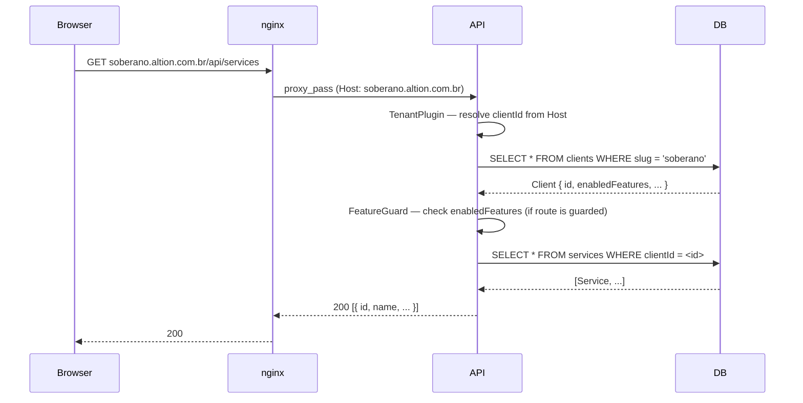
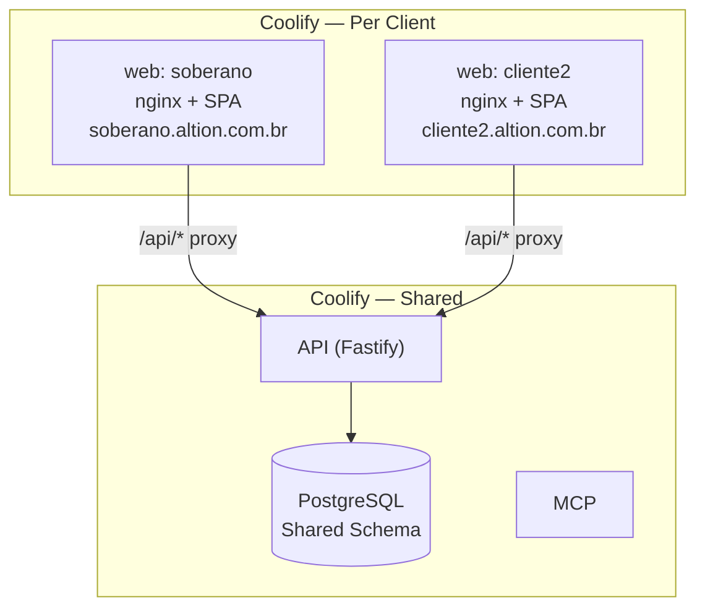

# Multi-Tenant SaaS Design

**Spec**: `.specs/features/multi-tenant-saas/spec.md`  
**Context**: `.specs/features/multi-tenant-saas/context.md`  
**Status**: Draft

---

## Architecture Overview

Every HTTP request passes through two new middleware layers before reaching any route handler. The `TenantPlugin` resolves which client is being served (from the `Host` header). The `FeatureGuard` checks if the requested feature is enabled for that client. Everything downstream receives a fully resolved `client` object on the request.





---

## Code Reuse Analysis

### Existing Components to Leverage

| Component | Location | How to Use |
|-----------|----------|------------|
| `authGuard` | `api/src/http/middleware/auth.middleware.ts` | Extend to also verify `barber.clientId === request.client.id` |
| `AppError` + error codes | `api/src/shared/errors.ts` | Add `TenantNotFoundError`, `FeatureDisabledError` |
| All `PrismaXxxRepository` classes | `api/src/infrastructure/database/repositories/` | Add `clientId` parameter to all scoped methods |
| `WhatsAppNotificationService` | `api/src/infrastructure/notifications/` | Refactor constructor to accept `ClientConfig` instead of reading global `env` |
| `env.ts` Zod schema | `api/src/config/env.ts` | Remove per-client Chatwoot vars (now stored in DB); keep shared vars |
| All UI components in `packages/web/src/components/ui/` | `Button`, `Input`, `Panel`, `Spinner`, etc. | Move to `packages/ui/` as the shared design system base |

### Integration Points

| System | Integration Method |
|--------|--------------------|
| Prisma schema | New `Client` model; `clientId` FK added to 4 existing models |
| Fastify plugin system | New `tenant.plugin.ts` registered globally before all routes |
| nginx `Host` header forwarding | Already in place via `proxy_set_header Host $host` — no nginx changes needed |
| Reminder cron job | Appointments query gains `clientId` via relation; notification service receives per-client config |

---

## Components

### 1. `Client` Prisma Model (new)

- **Purpose**: The tenant anchor — every other record belongs to a `Client`
- **Location**: `packages/api/prisma/schema.prisma`

```prisma
model Client {
  id              String   @id @default(uuid()) @db.Uuid
  slug            String   @unique @db.VarChar(50)
  name            String   @db.VarChar(200)
  customDomain    String?  @unique @map("custom_domain") @db.VarChar(255)
  enabledFeatures String[] @map("enabled_features")
  theme           Json     // { primaryColor, primaryColorHover, logoUrl }
  baseUrl         String   @map("base_url") @db.VarChar(255)
  timezone        String   @default("America/Campo_Grande")
  isActive        Boolean  @default(true) @map("is_active")

  // Per-client WhatsApp config (replaces global env vars)
  chatwootBaseUrl   String? @map("chatwoot_base_url") @db.VarChar(255)
  chatwootToken     String? @map("chatwoot_token") @db.VarChar(255)
  chatwootAccountId Int?    @map("chatwoot_account_id")
  chatwootInboxId   Int?    @map("chatwoot_inbox_id")

  createdAt DateTime @default(now()) @map("created_at") @db.Timestamptz
  updatedAt DateTime @default(now()) @updatedAt @map("updated_at") @db.Timestamptz

  barbers      Barber[]
  services     Service[]
  customers    Customer[]
  appointments Appointment[]

  @@map("clients")
}
```

---

### 2. Schema Migration — existing models

Add `clientId` to every tenant-owned table, and update uniqueness constraints to be client-scoped.

**`Barber`** — current `@@unique` on `slug` and `email` become client-scoped:
```prisma
clientId  String @map("client_id") @db.Uuid
client    Client @relation(fields: [clientId], references: [id])

// Replace @@unique([slug]) with:
@@unique([clientId, slug])
// Replace @@unique([email]) with:
@@unique([clientId, email])
```

**`Service`**:
```prisma
clientId  String @map("client_id") @db.Uuid
client    Client @relation(fields: [clientId], references: [id])

@@unique([clientId, slug])  // replaces @@unique([slug])
```

**`Customer`**:
```prisma
clientId  String @map("client_id") @db.Uuid
client    Client @relation(fields: [clientId], references: [id])

@@unique([clientId, phone])  // replaces @@unique([phone])
```

**`Appointment`** — add `clientId` for direct scoping (avoids join through barber):
```prisma
clientId  String @map("client_id") @db.Uuid
client    Client @relation(fields: [clientId], references: [id])

@@index([clientId, date])   // for reminder job queries
```

`BarberShift` and `BarberAbsence` are already tenant-scoped through `barberId → barber.clientId`. No change needed — route handlers already scope via the authenticated barber.

---

### 3. `TenantPlugin` — Fastify plugin

- **Purpose**: Resolves the `Client` from the `Host` header on every request; attaches it to `request.client`
- **Location**: `packages/api/src/http/plugins/tenant.plugin.ts`
- **Interfaces**:
  - `resolveTenant(host: string): Promise<ClientEntity | null>` — checks `customDomain` first, then subdomain
  - Registered via `app.addHook('onRequest', ...)` before all routes
- **Caching**: In-memory `Map<host, ClientEntity>` with no TTL (clients rarely change; server restart clears cache). Cache is invalidated manually when super-admin updates a client record.
- **Slug extraction**: `soberano.altion.com.br` → split on `.`, take first segment → `soberano`
- **Error**: returns `503 { error: 'CLIENT_NOT_FOUND' }` if no client matches or client is inactive

```typescript
// Fastify type augmentation
declare module 'fastify' {
  interface FastifyRequest {
    client: ClientEntity
  }
}
```

- **Exempt paths**: `/api/health` (health check should not require a tenant)
- **Dependencies**: new `ClientRepository`

---

### 4. `ClientRepository`

- **Purpose**: DB access for `Client` records; used by TenantPlugin and super-admin routes
- **Location**: `packages/api/src/domain/repositories/client.repository.ts` (interface) + `packages/api/src/infrastructure/database/repositories/prisma-client.repository.ts` (implementation)
- **Interfaces**:
  - `findBySlug(slug: string): Promise<ClientEntity | null>`
  - `findByCustomDomain(domain: string): Promise<ClientEntity | null>`
  - `findAll(): Promise<ClientEntity[]>`
  - `create(data: CreateClientData): Promise<ClientEntity>`
  - `updateFeatures(id: string, features: string[]): Promise<void>`

---

### 5. `FeatureGuard` — route-level hook

- **Purpose**: Protects routes that require a specific feature flag; returns `403` if disabled for the resolved client
- **Location**: `packages/api/src/http/middleware/feature.middleware.ts`
- **Interface**:
  - `requireFeature(feature: FeatureKey): (request, reply) => Promise<void>`
  - Used as a Fastify `preHandler` on specific route registrations

```typescript
export type FeatureKey =
  | 'booking'
  | 'admin-dashboard'
  | 'schedule-management'
  | 'whatsapp-notifications'
  | 'manual-booking'
  | 'whatsapp-ai-chatbot'
  | 'ai-features'

// Plan presets (used when creating a new client)
export const PLAN_FEATURES: Record<'site-only' | 'ai', FeatureKey[]> = {
  'site-only': ['booking', 'admin-dashboard', 'schedule-management', 'whatsapp-notifications', 'manual-booking'],
  'ai': ['booking', 'admin-dashboard', 'schedule-management', 'whatsapp-notifications', 'manual-booking', 'whatsapp-ai-chatbot', 'ai-features'],
}
```

---

### 6. `authGuard` — update

- **Purpose**: After JWT verification, verify the decoded `barberId` belongs to `request.client`
- **Location**: `packages/api/src/http/middleware/auth.middleware.ts` (modify existing)
- **Change**: After `verifyAccessToken`, do `barberRepo.findById(payload.barberId)` and check `barber.clientId === request.client.id`. Return `403` on mismatch.
- **Note**: This adds one extra DB query per authenticated request. Acceptable at current scale; can be embedded in JWT payload later as an optimization.

---

### 7. Repository interface updates

All repository methods that fetch tenant-owned data gain a `clientId` parameter. The existing method signatures are updated — not overloaded.

Examples:
```typescript
// BarberRepository
findAllActive(clientId: string): Promise<BarberEntity[]>
findById(id: string, clientId: string): Promise<BarberEntity | null>
findByEmail(email: string, clientId: string): Promise<BarberEntity | null>

// ServiceRepository
findAllActive(clientId: string): Promise<ServiceEntity[]>

// CustomerRepository
findByPhone(phone: string, clientId: string): Promise<CustomerEntity | null>
upsert(data: CreateCustomerData & { clientId: string }): Promise<CustomerEntity>

// AppointmentRepository — all methods gain clientId
findByBarberAndDate(barberId: string, date: Date, clientId: string): ...
findUpcomingWithoutReminder(minutesAhead: number): ... // no clientId needed — spans all tenants
```

All route handlers receive `clientId` from `request.client.id` and pass it to repositories.

---

### 8. `WhatsAppNotificationService` — refactor

- **Purpose**: Send WhatsApp messages using per-client Chatwoot config, with per-client `baseUrl` and `shopName`
- **Location**: `packages/api/src/infrastructure/notifications/whatsapp-notification.service.ts` (modify existing)
- **Change**: Remove global `env` dependency. Constructor accepts `ClientConfig`:

```typescript
interface ClientNotificationConfig {
  shopName: string
  baseUrl: string
  chatwootBaseUrl?: string
  chatwootToken?: string
  chatwootAccountId?: number
  chatwootInboxId?: number
}

export class WhatsAppNotificationService {
  constructor(private config: ClientNotificationConfig) { ... }
}
```

- Factory function used by route handlers and the reminder job:
```typescript
export function createNotificationService(client: ClientEntity): WhatsAppNotificationService
```

- All hardcoded `Soberano Barbearia` strings → `this.config.shopName`
- All `env.BASE_URL` refs → `this.config.baseUrl`
- `ChatwootClient` receives config from constructor instead of reading `env`

---

### 9. `ReminderJob` — update

- **Purpose**: Send reminders across all active tenants, using per-client notification config
- **Location**: `packages/api/src/infrastructure/jobs/reminder.job.ts` (modify existing)
- **Change**: The `findUpcomingWithoutReminder` query already spans all appointments. We need to:
  1. Include `client` relation in the appointment query result (`appointment.client`)
  2. For each appointment, call `createNotificationService(appointment.client)` to get the right config
  3. Send reminder with correct `shopName` and `baseUrl`

The Prisma query needs `include: { ..., client: true }` added to reminder queries.

---

### 10. `/api/client/config` endpoint (new public route)

- **Purpose**: Returns the resolved client's theme and feature flags to the frontend on app load; no auth required
- **Location**: `packages/api/src/http/routes/client.routes.ts` (new file)
- **Response**:

```typescript
GET /api/client/config
→ {
    name: string,
    timezone: string,
    enabledFeatures: string[],
    theme: {
      primaryColor: string,
      primaryColorHover: string,
      logoUrl: string | null
    }
  }
```

- Tenant is resolved by `TenantPlugin` (same as all other routes)
- No sensitive data exposed (no Chatwoot tokens, no internal IDs)

---

### 11. Frontend — `packages/ui` (new shared design system)

- **Purpose**: Shared component library and theme system used by all client apps
- **Location**: `packages/ui/`
- **Structure**:
  ```
  packages/ui/
  ├── src/
  │   ├── components/    (Button, Input, Panel, Spinner, StepIndicator, StickyBar, Footer)
  │   ├── theme/
  │   │   ├── ThemeProvider.tsx   (sets CSS custom properties from ClientConfig)
  │   │   └── types.ts            (ClientTheme, ClientConfig interfaces)
  │   ├── hooks/
  │   │   └── useClientConfig.ts  (fetches /api/client/config, caches in context)
  │   └── index.ts
  ├── package.json
  └── tsconfig.json
  ```
- **Migration**: Components are moved from `packages/web/src/components/ui/` to `packages/ui/src/components/` unchanged. `packages/web` imports them from `@altion/ui`.

---

### 12. Frontend — `ClientConfigProvider`

- **Purpose**: Fetches `/api/client/config` on app load, provides theme + features to the entire app
- **Location**: `packages/ui/src/hooks/useClientConfig.ts` + `packages/ui/src/theme/ClientConfigProvider.tsx`
- **Behavior**:
  1. On mount, calls `GET /api/client/config`
  2. Stores result in React context
  3. `ThemeProvider` reads `theme.primaryColor` and applies as CSS custom properties
  4. Feature-gate hook: `useFeature('whatsapp-ai-chatbot')` returns `boolean`

```typescript
// Usage in any client app
function App() {
  return (
    <ClientConfigProvider>
      <RouterProvider router={router} />
    </ClientConfigProvider>
  )
}

// Usage in components
const isAiEnabled = useFeature('whatsapp-ai-chatbot')
```

---

### 13. Frontend — per-client app structure

- **Location**: `packages/web/` stays as the reference implementation (Soberano)
- **New clients**: A new Coolify service is added pointing to the same `packages/web` source (same Docker image build), but with different env vars:
  ```env
  VITE_CLIENT_SLUG=cliente2   # used for logging/debugging only
  VITE_API_URL=               # empty = same-origin (via nginx proxy)
  ```
- The `theme.config.ts` approach (baked-in at build time) is **deferred** — instead, all theme is fetched at runtime from `/api/client/config`. This allows theme changes without redeployment.
- If a client needs a structurally different UI in the future, a new `apps/cliente-custom/` directory can be added to the monorepo.

---

### 14. Soberano Migration Script

- **Purpose**: Backfill all existing records with `clientId` for Soberano
- **Location**: `packages/api/prisma/migrations/[timestamp]_add_multi_tenant/` (Prisma migration) + `packages/api/src/infrastructure/database/seed-soberano-tenant.ts` (data migration)
- **Steps**:
  1. Create `Soberano` `Client` record (slug: `soberano`, name: `Soberano Barbearia`, baseUrl: from env)
  2. `UPDATE barbers SET client_id = <soberano_id>` (all 3 existing barbers)
  3. `UPDATE services SET client_id = <soberano_id>` (all 9 services)
  4. `UPDATE customers SET client_id = <soberano_id>` (all existing customers)
  5. `UPDATE appointments SET client_id = <soberano_id>` (all existing appointments)
  6. Populate `enabledFeatures` based on Soberano's plan (ai plan → all features)
  7. Populate `theme` with Soberano's current colors
- **Safety**: Run inside a Prisma transaction. If any step fails, the whole migration rolls back.

---

### 15. Super-Admin (P2 — separate phase)

Design deferred. The super-admin panel will be a separate protected route group (`/superadmin`) with its own JWT scope. It will use the `ClientRepository` directly and will not be scoped by the `TenantPlugin` (exempt path). Designed as a future feature once the P1 foundation is live.

---

## Data Models

### `ClientEntity` (TypeScript domain type)

```typescript
interface ClientTheme {
  primaryColor: string         // CSS hex, e.g. "#1a1a2e"
  primaryColorHover: string
  logoUrl: string | null
}

interface ClientEntity {
  id: string
  slug: string
  name: string
  customDomain: string | null
  enabledFeatures: string[]
  theme: ClientTheme
  baseUrl: string
  timezone: string
  isActive: boolean
  // WhatsApp config — present only when used by notification service
  chatwootBaseUrl?: string
  chatwootToken?: string
  chatwootAccountId?: number
  chatwootInboxId?: number
}
```

---

## Error Handling Strategy

| Error Scenario | Handling | HTTP Response |
|----------------|----------|---------------|
| Host doesn't match any client | TenantPlugin returns early | `503 CLIENT_NOT_FOUND` |
| Client is inactive (`isActive: false`) | TenantPlugin returns early | `503 CLIENT_INACTIVE` |
| Feature disabled for client | FeatureGuard returns early | `403 FEATURE_NOT_ENABLED` |
| JWT barber belongs to different tenant | authGuard returns early | `403 TENANT_MISMATCH` |
| `cancelToken` found but belongs to different client | `findByCancelToken` scoped by clientId | `404 NOT_FOUND` |
| Migration fails mid-way | Prisma transaction rolls back | No partial state |

---

## Tech Decisions

| Decision | Choice | Rationale |
|----------|--------|-----------|
| Tenant resolution via `Host` header | Already forwarded by nginx; no extra header needed | Zero frontend changes |
| `clientId` on `Appointment` directly | Redundant FK (could derive via `barber.clientId`) | Reminder job queries appointments without barber join; direct `clientId` is simpler and faster |
| In-memory tenant cache | Simple `Map<host, ClientEntity>` | Clients change rarely; a restart clears it. Redis/external cache is overkill at this scale |
| Theme at runtime via API | `/api/client/config` fetched on app load | Avoids rebuilding the frontend when theme changes; one Docker image per client is enough |
| No `clientId` on `BarberShift`/`BarberAbsence` | Already scoped via `barberId → barber.clientId` | Admin routes use authenticated `barberId`; no cross-tenant risk |
| Repository `clientId` as parameter | Vs. constructor injection | Less disruptive to existing code; no need to change how repos are instantiated |
| WhatsApp config in DB | Vs. per-client env vars | Env vars per client would require separate API deployments; DB config keeps one shared API |
