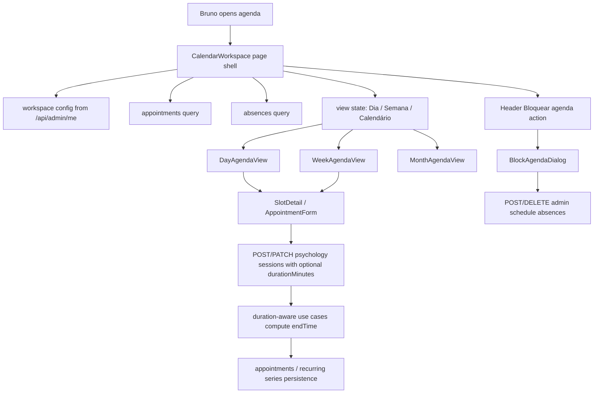

# web-bruno Calendar Workspace Design

**Spec**: `.specs/features/web-bruno-calendar-workspace/spec.md`
**Context**: `.specs/features/web-bruno-calendar-workspace/context.md`
**Status**: Draft

---

## Architecture Overview

The change splits into four coordinated slices:

1. **Provider workspace configuration** in the API/provider profile contract for visible hours and default duration.
2. **Duration-aware psychology scheduling** in create/edit/recurring flows so custom durations persist through `endTime`.
3. **Reusable calendar workspace shell** in `web-bruno` that replaces the week-only agenda surface with day/week/month navigation.
4. **Header-launched blocking flow** that reuses the existing absence model from inside the workspace instead of only from settings.



## Code Reuse Analysis

### Existing Components to Leverage

| Component | Location | How to Use |
|---|---|---|
| Provider profile settings hooks | `packages/web-bruno/src/api/settings.ts` | Extend `useProviderProfile()` and `useUpdateProviderProfile()` with workspace config fields |
| Agenda detail/correction modal | `packages/web-bruno/src/components/agenda/SlotDetail.tsx` | Reuse as the session action surface from day/week views |
| Session create/edit modal | `packages/web-bruno/src/components/appointments/AppointmentForm.tsx` | Add duration override support and consume workspace defaults |
| Existing appointment query hooks | `packages/web-bruno/src/api/appointments.ts` | Keep week/range invalidation patterns and broaden payloads with duration input |
| Existing absence hooks | `packages/web-bruno/src/api/settings.ts` | Reuse create/delete absence flows for a single header-launched blocking flow |
| Psychology scheduling use cases | `packages/api/src/application/use-cases/booking/create-psychology-session.ts`, `update-psychology-session.ts` | Extend to accept optional duration input and compute `endTime` accordingly |
| Recurring-series use cases | `packages/api/src/application/use-cases/booking/create-recurring-series.ts`, `materialize-recurring-series-window.ts`, `stop-recurring-series.ts` | Extend the recurring rule contract so future occurrences preserve the chosen duration |

### Integration Points

| System | Integration Method |
|---|---|
| Provider profile API | Extend `/api/admin/me` read/write payloads with workspace configuration |
| Psychology session API | Add optional `durationMinutes` to create/update contracts |
| Recurring series persistence | Store enough duration metadata to recreate future occurrences consistently |
| Provider absences | Reuse the existing `/api/admin/schedule/absences` endpoints from the workspace |
| `Agendamentos` workbench | Align default week range and refresh behavior with the new workspace model |

---

## Components

### Provider Workspace Configuration

- **Purpose**: Centralize Bruno's visible agenda window and default duration so multiple frontend surfaces stop duplicating day/hour assumptions.
- **Location**:
  - API route: `packages/api/src/http/routes/admin.routes.ts`
  - provider persistence/model: Prisma `Provider` plus repository/route typings
  - web hook typing: `packages/web-bruno/src/api/settings.ts`
- **Interfaces**:
  - `GET /api/admin/me -> { ..., workspaceStartTime, workspaceEndTime, defaultSessionDurationMinutes }`
  - `PATCH /api/admin/me` accepts the same workspace fields alongside the existing profile data
- **Dependencies**: provider auth scope, Prisma provider update flow
- **Reuses**: existing provider profile endpoint and settings page save path

### Calendar Workspace State Model

- **Purpose**: Hold the selected date, active view, week boundaries, hour rows, and start-slot options in one reusable place.
- **Location**:
  - `packages/web-bruno/src/lib/calendar-workspace.ts`
  - optionally a small local hook near agenda components, not a global Zustand store unless reuse demands it
- **Interfaces**:
  - `buildWorkspaceWeek(referenceDate): WorkspaceDay[]`
  - `buildWorkspaceHourRows(config): string[]`
  - `buildStartTimeOptions(config): Array<{ value: string; label: string }>`
- **Dependencies**: provider workspace config, date-fns
- **Reuses**: current `startOfWeek()`/`addDays()` week navigation pattern from appointments hooks/pages

### Calendar Workspace Shell

- **Purpose**: Replace the week-only dashboard grid with one agenda surface that can render day/week/month modes.
- **Location**:
  - `packages/web-bruno/src/components/agenda/CalendarWorkspace.tsx`
  - supporting sub-components in the same folder
- **Interfaces**:
  - `CalendarWorkspace({ onCreateAppointment, onEditAppointment, onNotice })`
  - internal subviews:
    - `CalendarWorkspace.DayView`
    - `CalendarWorkspace.WeekView`
    - `CalendarWorkspace.MonthView`
- **Dependencies**: appointments query hooks, absences query hooks, workspace config helper, existing week navigator concepts
- **Reuses**: `SlotDetail`, `TimeSlot`, existing notice/edit/create wiring from `DashboardPage`

### Duration-Aware Appointment Form

- **Purpose**: Apply the configured default duration automatically while allowing Bruno to override it before saving.
- **Location**:
  - `packages/web-bruno/src/components/appointments/AppointmentForm.tsx`
  - `packages/web-bruno/src/schemas/appointment.schema.ts`
  - `packages/web-bruno/src/api/appointments.ts`
- **Interfaces**:
  - create/update payload accepts optional `durationMinutes`
  - form preloads `defaultSessionDurationMinutes`
  - form exposes a duration override control
- **Dependencies**: provider profile config, appointment mutation hooks
- **Reuses**: existing create/edit modal lifecycle and validation flow

### Duration-Aware Scheduling Use Cases

- **Purpose**: Compute `endTime` from the chosen duration and keep conflict detection correct.
- **Location**:
  - `packages/api/src/application/use-cases/booking/create-psychology-session.ts`
  - `packages/api/src/application/use-cases/booking/update-psychology-session.ts`
  - `packages/api/src/application/use-cases/booking/psychology-session.utils.ts`
  - recurring-series use cases and route contracts
- **Interfaces**:
  - `CreatePsychologySessionInput.durationMinutes?: number`
  - `UpdatePsychologySessionInput.durationMinutes?: number`
  - recurring-series create/materialization contract preserves duration
- **Dependencies**: provider defaults, appointment repo conflict checks
- **Reuses**: existing `assertNoScheduleConflict()` and date/time update patterns

### Header-Launched Agenda Blocking

- **Purpose**: Let Bruno create or remove full-day/time-range blocks from one workspace header action instead of adding block buttons inside the calendar.
- **Location**:
  - `packages/web-bruno/src/components/agenda/BlockAgendaDialog.tsx`
  - `packages/web-bruno/src/components/agenda/CalendarWorkspace.tsx`
  - existing settings hooks in `packages/web-bruno/src/api/settings.ts`
  - optional backend validation in `packages/api/src/http/routes/schedule.routes.ts`
- **Interfaces**:
  - create absence: `{ date, startTime?, endTime?, reason? }`
  - remove absence by `id`
- **Dependencies**: absences query/mutation hooks, workspace header state, selected/reference date context
- **Reuses**: existing provider absence model and settings endpoints

### Appointments Workbench Alignment

- **Purpose**: Keep the secondary `Agendamentos` surface aligned with the new week boundaries and query refresh semantics.
- **Location**:
  - `packages/web-bruno/src/pages/AppointmentsPage.tsx`
  - `packages/web-bruno/src/components/appointments/AppointmentsWorkbench.tsx`
- **Interfaces**:
  - default current-week range uses the shared Monday-through-Sunday builder
- **Dependencies**: shared workspace helpers, existing appointments hooks
- **Reuses**: current list/detail/edit surface

---

## Data Models

### ProviderWorkspaceSettings

```ts
type ProviderWorkspaceSettings = {
  workspaceStartTime: string
  workspaceEndTime: string
  defaultSessionDurationMinutes: number
}
```

**Relationships**:
- scoped to the authenticated provider profile
- consumed by dashboard agenda, appointment form, and settings page

### DurationAwareAppointmentInput

```ts
type DurationAwareAppointmentInput = {
  date: string
  startTime: string
  durationMinutes?: number
}
```

**Relationships**:
- optional override on top of provider defaults
- backend converts it into persisted `endTime`

### RecurringSeriesDurationRule

```ts
type RecurringSeriesDurationRule = {
  startTime: string
  durationMinutes: number
}
```

**Relationships**:
- stored on the recurring rule so materialized future appointments keep the chosen duration

### CalendarWorkspaceViewState

```ts
type CalendarWorkspaceView = 'day' | 'week' | 'month'

type CalendarWorkspaceState = {
  view: CalendarWorkspaceView
  referenceDate: Date
}
```

**Relationships**:
- local UI state for navigation across all workspace subviews

---

## Error Handling Strategy

| Error Scenario | Handling | User Impact |
|---|---|---|
| Invalid workspace hour window (`start >= end`) | Validate in profile update route and settings form | Bruno sees a direct settings validation error |
| Invalid custom duration (`<= 0`) | Validate in form and route contract | Save is blocked with a clear message |
| Duration override creates overlap | Existing schedule conflict path returns 409 | Bruno keeps the form open and can adjust time/duration |
| Block request overlaps active appointments | Reject block creation with validation error | Bruno must resolve the sessions first |
| Workspace config missing on older providers | Fallback to current visible defaults while config is backfilled | Agenda still renders without a blank state |

---

## Tech Decisions

| Decision | Choice | Rationale |
|---|---|---|
| Workspace config storage | Provider profile fields via `/api/admin/me` | Existing Bruno settings already flow through provider profile; this keeps config request-scoped and editable |
| Visible week coverage | Shared Monday-through-Sunday workspace model | The real frontend gap is hidden Sunday data; v1 should normalize the whole workspace around a 7-day week |
| Visible hour window | Explicit config, not only shifts | Psychology session flows already allow off-shift appointments, so shifts alone are not a safe source of truth for what the workspace must render |
| Start-slot step | Shared hourly slot model | Matches the requested "hora fixa" behavior while still allowing custom occupied duration after the chosen start |
| Custom duration persistence | Optional `durationMinutes` input that computes persisted `endTime` | Fits the current appointment model without requiring a new appointment-duration column |
| Month view scope | Navigational only in v1 | Keeps the first release smaller while still satisfying the multi-view agenda requirement |

## Design Notes

- This feature intentionally reuses the existing absence model instead of inventing a second blocking concept.
- The calendar should stay visually passive for blocking; the block command belongs in the workspace header, not inside cells or slot rows.
- Because recurring-series work already exists as a separate feature, the duration-rule extension here should be implemented in a way that composes with `web-bruno-recurring-session-series` rather than forking a second recurrence path.
- The existing `WeeklyGrid` can be retired or reduced to an internal `WeekView` sub-component once the workspace shell lands.
