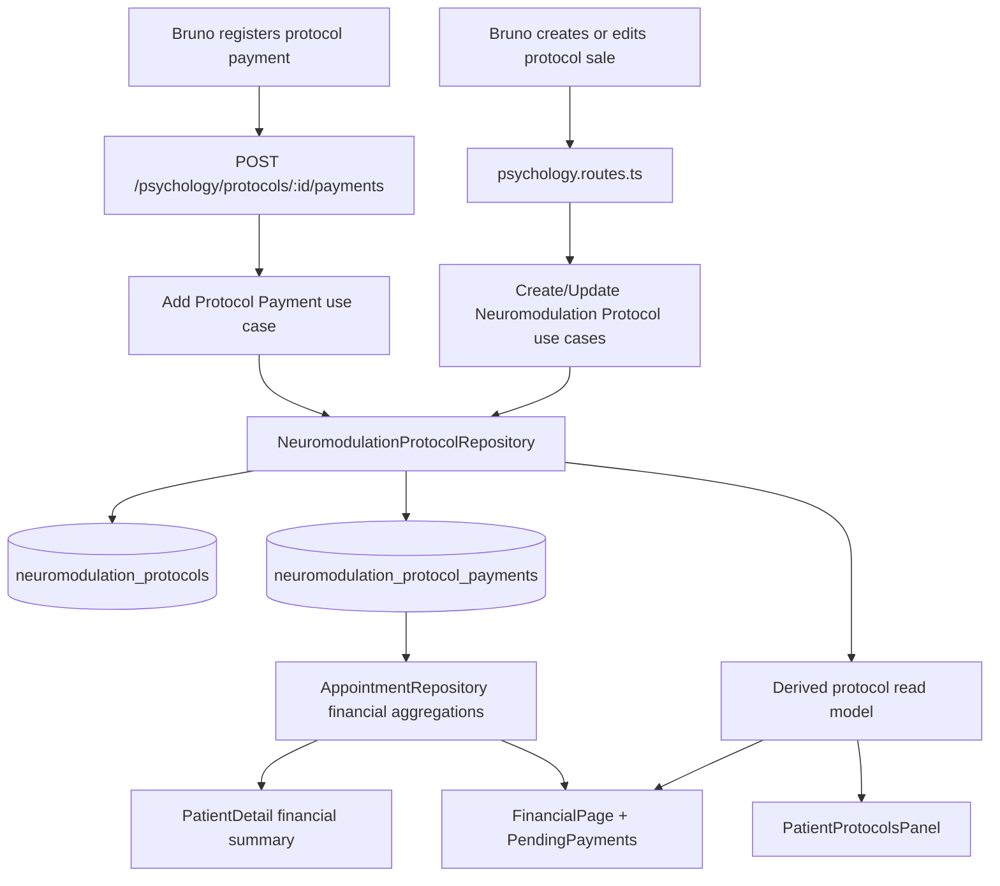

# web-bruno Protocol Payment Ledger — Design

**Spec**: `.specs/features/web-bruno-protocol-payment-ledger/spec.md`
**Status**: Draft

---

## Architecture Overview

The payment ledger becomes the source of truth for protocol-sale finance. Instead of storing one `paymentMethod` and one `paidAt` on `NeuromodulationProtocol`, the backend will persist payment entries in a child table, derive protocol payment state from the sum of those entries, and expose the resulting read model to both the Bruno protocol panel and the shared financial surfaces.



### Flow summary

1. Protocol commercial value still lives on `neuromodulation_protocols`.
2. Each real receipt becomes one `neuromodulation_protocol_payments` row with its own amount, method, and date.
3. Repository mappers derive `paymentStatus`, `paidAmountCents`, `remainingAmountCents`, and `lastPaymentAt`.
4. Financial reporting flattens payment rows by `paidAt`, while receivable views use only the remaining open balance per protocol.

---

## Code Reuse Analysis

### Existing Components to Leverage

| Component | Location | How to Use |
| --- | --- | --- |
| Protocol routes + mapping | `packages/api/src/http/routes/psychology.routes.ts` | Keep the existing protocol route block and extend it with ledger-aware payloads plus a dedicated payment endpoint |
| Protocol repository | `packages/api/src/infrastructure/database/repositories/prisma-neuromodulation-protocol.repository.ts` | Continue owning the protocol aggregate read model, now including payment rows and derived commercial totals |
| Protocol validation helpers | `packages/api/src/application/use-cases/booking/neuromodulation-protocol.utils.ts` | Replace scalar paid/pending validation with ledger-specific amount/date guards |
| Financial summary aggregation | `packages/api/src/infrastructure/database/repositories/prisma-appointment.repository.ts` | Reuse the existing mixed appointment + protocol financial query shape, but swap protocol revenue from protocol scalars to payment rows |
| React Query invalidation | `packages/web-bruno/src/api/protocols.ts` | Preserve the existing invalidation scope for `patients`, `appointments`, `protocols`, and `financial` queries |
| Pending-payment shell | `packages/web-bruno/src/components/financial/PendingPayments.tsx` | Reuse list, filtering, and selection UX; only change protocol rows to capture amount/date/method through a protocol-specific dialog |
| Protocol workspace panel | `packages/web-bruno/src/components/protocols/PatientProtocolsPanel.tsx` | Keep the panel as the protocol management surface and add ledger summary/history + add-payment action there |

### Integration Points

| System | Integration Method |
| --- | --- |
| Prisma | Add a child payment model related to `NeuromodulationProtocol`, backfill legacy scalar payments, then derive protocol finance from the child rows |
| API clean architecture | Keep routes thin; introduce ledger-aware use-case methods and repository contract extensions instead of Prisma logic in routes |
| Bruno frontend | Continue consuming protocol data through `api/protocols.ts` and `api/financial.ts`; split create/update protocol sale mutations from add-payment mutations |
| Patient financial detail | Reuse `AppointmentRepository.getPatientFinancialSummary()` and update protocol totals to use paid sum + remaining balance |

### Constraints from the current codebase

- `packages/shared` does not currently define Bruno protocol contracts, so this feature stays inside `packages/api` and `packages/web-bruno`.
- Appointment payment state stays binary (`pending|paid`). The new `partial` state must exist only for protocols, not for psychology sessions.
- `FinancialPage` currently assumes one protocol-level `paidAt` and full `totalPriceCents` revenue. That path must change together with the ledger model or the UI will misstate revenue.

---

## Backend Design

### 1. Persistence model

Add a child payment table under the protocol aggregate:

```prisma
model NeuromodulationProtocolPayment {
  id            String   @id @default(uuid()) @db.Uuid
  tenantId      String   @map("tenant_id") @db.Uuid
  protocolId    String   @map("protocol_id") @db.Uuid
  amountCents   Int      @map("amount_cents")
  paymentMethod String   @map("payment_method") @db.VarChar(20)
  paidAt        DateTime @map("paid_at") @db.Timestamptz
  createdAt     DateTime @default(now()) @map("created_at") @db.Timestamptz
  updatedAt     DateTime @default(now()) @updatedAt @map("updated_at") @db.Timestamptz

  tenant   Tenant                  @relation(fields: [tenantId], references: [id])
  protocol NeuromodulationProtocol @relation(fields: [protocolId], references: [id])

  @@index([protocolId, paidAt])
  @@index([tenantId, paidAt])
  @@map("neuromodulation_protocol_payments")
}
```

At the same time, remove protocol-level `paymentMethod` and `paidAt` from `NeuromodulationProtocol`. `paymentStatus` also stops being a stored column and becomes a derived read-model field:

- `pending`: no payment rows
- `partial`: paid sum is `> 0` and `< totalPriceCents`
- `paid`: paid sum equals `totalPriceCents`

### 2. Legacy migration strategy

The migration must backfill historical rows before removing the legacy scalar columns:

- legacy `paymentStatus = paid` → create one payment row with:
  - `amountCents = totalPriceCents`
  - `paymentMethod = protocol.paymentMethod`
  - `paidAt = protocol.paidAt ?? protocol.createdAt`
- legacy `paymentStatus = pending` → create no payment rows

This preserves current financial meaning while moving the source of truth to the ledger.

### 3. Repository responsibilities

Keep the ledger inside `NeuromodulationProtocolRepository` instead of creating a second top-level repository. The payment rows are only meaningful in the context of one protocol aggregate, and the existing repository already owns the protocol read model.

Repository additions:

- `create(...)` accepts an optional `initialPayment`
- `addPayment(protocolId, data)` appends one ledger entry
- `findById()` / `findWithCountersById()` / `findByCustomerId()` include payment rows and derive:
  - `paymentStatus`
  - `paidAmountCents`
  - `remainingAmountCents`
  - `lastPaymentAt`
- payment rows are returned ordered by `paidAt ASC`, then `createdAt ASC`

### 4. Use cases and route contracts

#### Create protocol

`POST /psychology/patients/:id/protocols`

Replace the binary payment fields with an optional initial payment object:

```json
{
  "totalSessions": 36,
  "totalPriceCents": 360000,
  "status": "active",
  "initialPayment": {
    "amountCents": 100000,
    "paymentMethod": "pix",
    "paidAt": "2026-06-08T03:00:00.000Z"
  },
  "notes": "..."
}
```

#### Update protocol sale

`PATCH /psychology/protocols/:id`

This route remains for commercial metadata only:

- `totalSessions?`
- `totalPriceCents?`
- `status?`
- `notes?`

It no longer mutates payment history.

#### Add payment entry

`POST /psychology/protocols/:id/payments`

```json
{
  "amountCents": 260000,
  "paymentMethod": "card",
  "paidAt": "2026-07-10T03:00:00.000Z"
}
```

Response: the updated protocol read model, including `payments`, `paymentStatus`, `paidAmountCents`, and `remainingAmountCents`.

### 5. Validation rules

Shared backend guards:

- amount must be `> 0`
- `paidAt` cannot be in the future
- `paidAmountCents + new amount` cannot exceed `totalPriceCents`
- `totalPriceCents` cannot be reduced below the already-paid sum
- immutable ledger for this phase: no edit/delete payment entry endpoints

---

## Financial Aggregation Design

### Shared financial summary

`AppointmentRepository.getFinancialSummary()` keeps its mixed response shape, but protocol revenue comes from payment rows:

- protocol paid revenue = sum of payment rows inside the requested date range
- pending protocol receivables = protocols whose `remainingAmountCents > 0`
- protocol pending amount = `remainingAmountCents`, not `totalPriceCents`
- linked operational appointments remain excluded from protocol-sale revenue exactly as today

This means `FinancialSummary.protocolSales` should return protocols with their payment arrays so the frontend can both:

- flatten payment rows into chart/revenue entries
- render open protocol balances in the pending area

### Patient financial summary

`AppointmentRepository.getPatientFinancialSummary()` changes protocol totals to:

- `paidTotalCents` = sum of all protocol payment rows
- `pendingTotalCents` = sum of `remainingAmountCents` for open protocols
- `paidCount` = fully settled protocol sales
- `pendingCount` = protocols with remaining balance `> 0`

Partial protocols remain pending until fully settled.

---

## Frontend Design

### 1. Protocol schemas and hook contracts

Update `packages/web-bruno/src/schemas/protocol.schema.ts` to define protocol-specific payment types:

```ts
type ProtocolPaymentStatus = 'pending' | 'partial' | 'paid'

type ProtocolPayment = {
  id: string
  amountCents: number
  paymentMethod: 'card' | 'pix' | 'cash'
  paidAt: string
  createdAt: string
  updatedAt: string
}

type Protocol = {
  id: string
  patientId: string
  totalSessions: number
  reservedSessions: number
  consumedSessions: number
  remainingSessions: number
  totalPriceCents: number
  paidAmountCents: number
  remainingAmountCents: number
  paymentStatus: ProtocolPaymentStatus
  lastPaymentAt?: string
  payments: ProtocolPayment[]
  status: 'active' | 'maintenance' | 'finished'
  notes?: string
  createdAt: string
  updatedAt: string
}
```

Do not widen the appointment payment schema to include `partial`. Protocol payment typing stays separate so session forms and history filters remain binary.

Hook changes in `api/protocols.ts`:

- `useCreateProtocol(patientId)` accepts `CreateProtocolData`
- `useUpdateProtocol()` accepts `UpdateProtocolData`
- new `useAddProtocolPayment()` accepts `{ id, patientId, data }`

### 2. Protocol creation/editing UX

`ProtocolForm.tsx` splits create vs edit responsibilities:

- create mode: protocol commercial fields + optional initial payment block
- edit mode: protocol commercial fields only

This avoids letting a normal edit overwrite immutable payment history.

### 3. Dedicated protocol payment dialog

Create a protocol-specific payment dialog rather than overloading the appointment `PaymentMethodDialog`.

Why:

- appointments need only method + date because the amount is the session value
- protocols need amount + method + date, plus current remaining balance context

Reused surfaces:

- `PatientProtocolsPanel.tsx`
- `PendingPayments.tsx` for protocol receivable rows

### 4. Protocol panel presentation

`PatientProtocolsPanel.tsx` becomes the main ledger audit surface:

- show protocol total, paid amount, remaining balance
- show derived payment status label (`Pendente`, `Parcial`, `Pago`)
- show payment history list ordered by receipt date
- show `Registrar pagamento` while `remainingAmountCents > 0`
- hide the add-payment action for fully paid protocols

### 5. Financial surfaces

`FinancialPage.tsx` and `PendingPayments.tsx` change protocol behavior:

- revenue chart/cards flatten `protocol.payments`
- each payment row contributes only its own `amountCents` on its own `paidAt`
- pending protocol rows use `remainingAmountCents`
- partially paid protocols stay visible in pending surfaces until settled

### 6. Patient financial detail

`PatientDetailPage.tsx` keeps the same card layout but displays ledger-aware protocol totals:

- paid total from protocol payment sum
- pending total from remaining balances
- counts based on settled vs still-open protocol sales

---

## Components

### `NeuromodulationProtocolRepository` ledger extension

- **Purpose**: Persist payment rows and produce the protocol aggregate read model with derived finance fields.
- **Location**: `packages/api/src/domain/repositories/neuromodulation-protocol.repository.ts` and `packages/api/src/infrastructure/database/repositories/prisma-neuromodulation-protocol.repository.ts`
- **Interfaces**:
  - `create(data): Promise<NeuromodulationProtocolEntity>`
  - `addPayment(protocolId, data): Promise<void>`
  - `findWithCountersById(id): Promise<NeuromodulationProtocolWithCounters | null>`
- **Dependencies**: Prisma protocol + payment relations
- **Reuses**: Existing protocol counter projection logic

### `AddNeuromodulationProtocolPaymentUseCase`

- **Purpose**: Validate and append a protocol payment without exposing Prisma or aggregate math to routes.
- **Location**: `packages/api/src/application/use-cases/booking/add-neuromodulation-protocol-payment.ts`
- **Interfaces**:
  - `execute({ protocolId, amountCents, paymentMethod, paidAt }): Promise<NeuromodulationProtocolWithCounters>`
- **Dependencies**: `NeuromodulationProtocolRepository`
- **Reuses**: Existing not-found and validation error patterns from protocol use cases

### `ProtocolPaymentDialog`

- **Purpose**: Collect payment amount, method, and date for protocol receivable actions.
- **Location**: `packages/web-bruno/src/components/protocols/ProtocolPaymentDialog.tsx`
- **Interfaces**:
  - `open: boolean`
  - `remainingAmountCents: number`
  - `onConfirm(amountCents, paymentMethod, paidAt): void`
- **Dependencies**: `Button`, `Input`, `Modal`, `Select`
- **Reuses**: Existing modal/form visual language from `PaymentMethodDialog` and `ProtocolForm`

---

## Data Models

### Protocol payment entry

```ts
type ProtocolPaymentMethod = 'card' | 'pix' | 'cash'

interface NeuromodulationProtocolPaymentEntity {
  id: string
  tenantId: string
  protocolId: string
  amountCents: number
  paymentMethod: ProtocolPaymentMethod
  paidAt: Date
  createdAt: Date
  updatedAt: Date
}
```

**Relationships**: Many payment entries belong to one `NeuromodulationProtocol`.

### Derived protocol finance read model

```ts
type ProtocolPaymentStatus = 'pending' | 'partial' | 'paid'

interface NeuromodulationProtocolEntity {
  id: string
  tenantId: string
  providerId: string
  customerId: string
  totalSessions: number
  status: 'active' | 'maintenance' | 'finished'
  totalPriceCents: number
  paymentStatus: ProtocolPaymentStatus
  paidAmountCents: number
  remainingAmountCents: number
  lastPaymentAt: Date | null
  manualConsumedCount: number
  notes: string | null
  createdAt: Date
  updatedAt: Date
}
```

`NeuromodulationProtocolWithCounters` extends this model with:

- `reservedSessions`
- `consumedSessions`
- `remainingSessions`
- `payments: NeuromodulationProtocolPaymentEntity[]`

---

## Error Handling Strategy

| Error Scenario | Handling | User Impact |
| --- | --- | --- |
| Payment amount is zero or negative | Reject in use case with `ValidationError` | Bruno sees inline validation and no ledger row is created |
| Payment exceeds remaining balance | Reject in use case before insert | Bruno must correct the amount or edit the protocol total first |
| Payment date is in the future | Reject in use case | Bruno cannot register unreconciled future receipts |
| Protocol total is edited below amount already received | Reject in update use case | Existing ledger history stays intact |
| Legacy paid protocol has null `paidAt` | Migration falls back to `createdAt` | Historical paid protocols remain reportable after migration |

---

## Tech Decisions

| Decision | Choice | Rationale |
| --- | --- | --- |
| Protocol finance source of truth | Child payment ledger rows | Prevents dual-write drift and supports multiple dates/amounts cleanly |
| Protocol payment status | Derived `pending|partial|paid` read model | Keeps business meaning aligned with the paid sum instead of stored flags |
| Payment mutations | Dedicated `POST /psychology/protocols/:id/payments` | Appending receipts is a different workflow from editing protocol sale metadata |
| Protocol UI payment capture | New protocol-specific dialog | Appointment payment dialog cannot safely represent partial protocol amounts |
| Ledger mutability in this phase | Append-only, no edit/delete payment entries | Smallest safe scope for the first ledger release |
| Web typing | Separate protocol payment status from appointment payment status | Avoids leaking `partial` into psychology session flows that remain binary |
