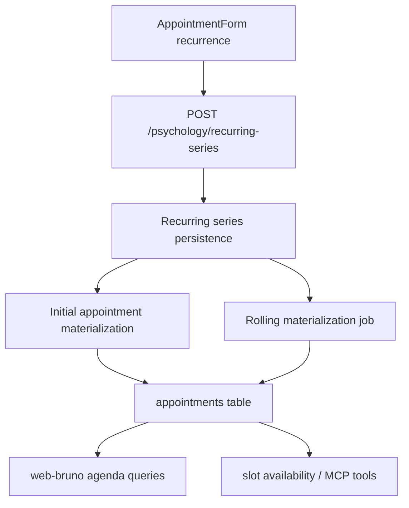

# web-bruno Recurring Session Series Design

**Spec**: `.specs/features/web-bruno-recurring-session-series/spec.md`
**Status**: Draft

---

## Architecture Overview

The current recurrence flow is a thin frontend wrapper over `POST /psychology/sessions/batch`, which only creates a finite set of weekly appointments. That abstraction must be replaced with a persistent recurring-series model plus rolling appointment materialization.

Recommended flow:

1. `web-bruno` creates a recurring-series rule with the cadence and the first slot.
2. The API stores the series and materializes concrete `appointments` for a protected future horizon.
3. A recurring-materialization job keeps that horizon filled while the series is active.
4. Agenda, financial, and AI availability flows continue to read concrete `appointments`, so they do not need to understand recurrence rules directly for the main path.



## Code Reuse Analysis

### Existing Components to Leverage

| Component | Location | How to Use |
|---|---|---|
| Session create/edit modal | `packages/web-bruno/src/components/appointments/AppointmentForm.tsx` | Replace batch-weeks recurrence controls with cadence-based series creation |
| Session list hooks | `packages/web-bruno/src/api/appointments.ts` | Add recurring-series mutations while keeping current week/range queries |
| Psychology session routes | `packages/api/src/http/routes/psychology.routes.ts` | Reuse authentication/provider scoping and session mapping patterns |
| Reminder job bootstrap | `packages/api/src/infrastructure/jobs/reminder.job.ts` | Mirror the job registration pattern for recurrence replenishment |
| Availability computation | `packages/api/src/application/use-cases/booking/get-available-slots.ts` | Keep consuming concrete appointments; avoid duplicating recurrence logic there if the horizon stays filled |

### Integration Points

| System | Integration Method |
|---|---|
| Prisma / PostgreSQL | Add recurring-series persistence and link appointments to a series |
| Psychology API | Add create/stop/materialize flows for recurring series |
| web-bruno agenda | Show recurrence metadata and stop-series action |
| MCP availability tools | Continue using booked appointments; correctness depends on materialization horizon |

---

## Components

### Recurring Series Persistence

- **Purpose**: Store the recurrence rule independently from individual appointment rows.
- **Location**: `packages/api/prisma/schema.prisma` + migration
- **Interfaces**:
  - `RecurringAppointmentSeries { id, tenantId, providerId, customerId, serviceId, startDate, startTime, endTime, intervalWeeks, status, stopDate?, notes?, priceCents? }`
  - `Appointment.recurringSeriesId?`
- **Dependencies**: Prisma, tenant/provider scoping
- **Reuses**: Existing appointment/service/customer relations

### Recurring Series Application Flow

- **Purpose**: Encapsulate business rules for creating, stopping, and replenishing series without pushing more logic into Fastify routes.
- **Location**: `packages/api/src/application/use-cases/booking/`
- **Interfaces**:
  - `CreateRecurringSeriesUseCase.execute(input)`
  - `StopRecurringSeriesUseCase.execute(input)`
  - `MaterializeRecurringSeriesWindowUseCase.execute(input)`
- **Dependencies**: Appointment repository, series repository, service repository
- **Reuses**: Existing slot-conflict rules and appointment creation rules

### Recurring Series HTTP Contract

- **Purpose**: Expose recurrence operations to `web-bruno`.
- **Location**: `packages/api/src/http/routes/psychology.routes.ts`
- **Interfaces**:
  - `POST /psychology/recurring-series`
  - `PATCH /psychology/recurring-series/:id/stop` or `DELETE /psychology/recurring-series/:id`
  - Session payloads include `recurringSeriesId` and recurrence metadata when relevant
- **Dependencies**: Auth guard, tenant/provider scope
- **Reuses**: Existing session DTO mapping and validation style

### Rolling Materialization Job

- **Purpose**: Keep the protected future horizon filled for active series.
- **Location**: `packages/api/src/infrastructure/jobs/`
- **Interfaces**:
  - periodic job over active tenants/providers/series
  - materialize until `today + protectedHorizonDays`
- **Dependencies**: Prisma, recurring-series use case
- **Reuses**: Existing cron startup pattern from the reminder job

### web-bruno Recurrence UI

- **Purpose**: Let Bruno create cadence-based recurrence and stop it later.
- **Location**:
  - `packages/web-bruno/src/components/appointments/AppointmentForm.tsx`
  - `packages/web-bruno/src/components/agenda/SlotDetail.tsx`
  - `packages/web-bruno/src/api/appointments.ts`
- **Interfaces**:
  - recurrence toggle + interval selector
  - stop-series action for a recurring occurrence
  - recurrence label in details/edit flow
- **Dependencies**: TanStack Query mutations, session DTO
- **Reuses**: Existing modal/detail flow in the agenda

---

## Data Models

### RecurringAppointmentSeries

```ts
type RecurringAppointmentSeries = {
  id: string
  tenantId: string
  providerId: string
  customerId: string
  serviceId: string
  startDate: string
  startTime: string
  endTime: string
  intervalWeeks: number
  status: 'active' | 'stopped'
  stopDate?: string | null
  priceCents?: number | null
  notes?: string | null
  createdAt: string
  updatedAt: string
}
```

**Relationships**: one recurring series generates many `appointments`; each appointment can optionally point back to its source series.

### Session Payload Extension

```ts
type SessionRecurrenceMeta = {
  recurringSeriesId?: string
  recurrenceIntervalWeeks?: number
  recurrenceStatus?: 'active' | 'stopped'
}
```

**Relationships**: attached to agenda/session responses so the UI can explain whether the occurrence belongs to an active series.

---

## Error Handling Strategy

| Error Scenario | Handling | User Impact |
|---|---|---|
| Start slot already occupied | Reject series creation with 409 | Bruno sees immediate conflict and can choose another slot |
| Future occurrence cannot be materialized | Record surfaced conflict and return actionable status | Bruno is warned that the series needs attention |
| Stop-series request for unknown series | Return 404 | No silent failure |
| Recurrence interval invalid (`<1`) | Validation error | UI keeps form open and explains the problem |

---

## Tech Decisions

| Decision | Choice | Rationale |
|---|---|---|
| Persistence model | Separate recurring-series table + `appointments.recurringSeriesId` | Supports "until deleted" without infinite row creation |
| Cadence model | `intervalWeeks` integer | Covers weekly, biweekly, and "etc." with one field |
| Availability strategy | Keep concrete appointments materialized for a rolling horizon | Preserves current agenda and AI availability logic with minimal downstream change |
| Protected horizon | Default to at least 90 days | AI scans up to 60 days today; 90 gives a safety buffer |
| Stop behavior | Stop future generation and remove/cancel future occurrences from stop point onward | Matches "até que eu exclua" while preserving history |

## Implementation Notes

- `useCreateRecurringAppointments()` should stop calling `/psychology/sessions/batch` for this workflow.
- `POST /psychology/sessions/batch` can be retained temporarily for backward compatibility, but recurring-session creation in `web-bruno` should migrate away from it.
- Because `psychology.routes.ts` already contains inline session logic, this feature is a good point to move recurrence-specific rules into application use cases instead of expanding route-level business logic further.
